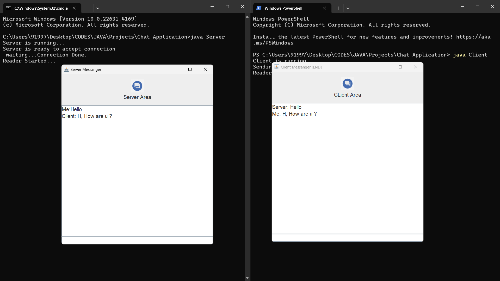

# SocketTalk: Simple Java Chat Application

This repository contains the complete implementation of a simple Java chat application, including both the **server** and **client** components. It demonstrates real-time communication between a server and client using sockets, with a graphical user interface (GUI) for sending and receiving messages.

## Table of Contents
- [Features](#features)
- [Technologies Used](#technologies-used)
- [How It Works](#how-it-works)
- [Setup Instructions](#setup-instructions)
- [Screenshots](#screenshots)
- [Future Enhancements](#future-enhancements)

## Features
- **Server-Client Communication**: Establishes real-time messaging between a server and a client.
- **Multi-threaded Server**: The server uses multi-threading to handle simultaneous reading and writing of messages.
- **Graphical User Interface (GUI)**: Both the server and client interfaces are built using Java Swing, allowing for interactive message exchanges.
- **Graceful Termination**: The chat session ends smoothly when either the server or client types "exit".

## Technologies Used
- **Java**: For socket programming, threading, and overall application logic.
- **Swing (Javax.Swing)**: To build the graphical user interface (GUI).
- **Socket Programming**: For real-time communication between server and client over a network.
- **Multi-threading**: To allow simultaneous read and write operations without blocking.

## How It Works
1. **Start the Server**: The server listens for a client connection on a specified port.
2. **Client Connects**: The client connects to the server, enabling real-time messaging.
3. **Message Exchange**: The server and client can exchange messages, which are displayed in a chat window.
4. **Exit**: Typing "exit" on either side will close the connection and terminate the chat session.

## Setup Instructions

### Prerequisites
- Java Development Kit (JDK) installed on your machine.
### How to run
Compile and Run the Server first then Compile and Run the Client.  [ex., javac Server.java then java Server ]

## Screenshots

## Future Enhancements
- **Multiple Clients**: Expand the server to handle multiple clients simultaneously.
- **File Transfer**: Add functionality for sending files between the server and client.
- **Encryption**: Implement message encryption for secure communication.

